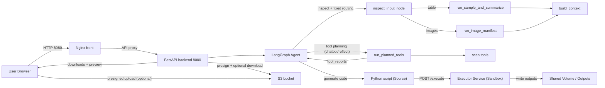
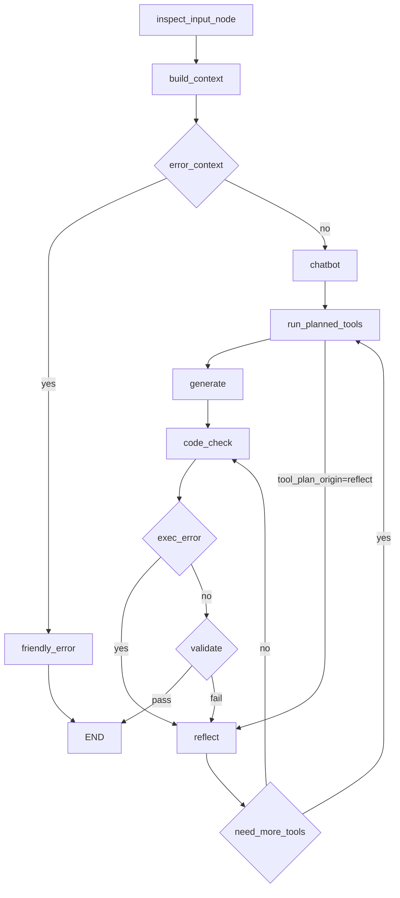
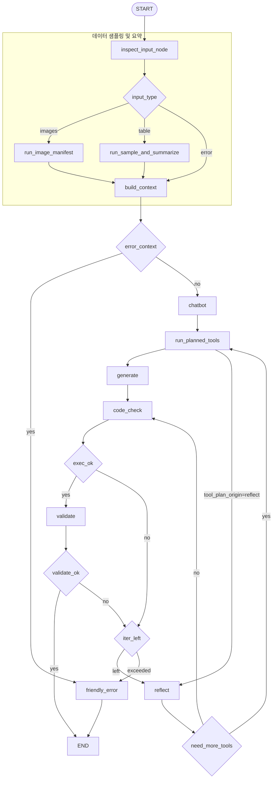

# 데이터 전처리 에이전트 (LangGraph + FastAPI) — 데모

자연어로 “이 데이터 전처리해줘”를 입력하면, **LangGraph 기반 에이전트가 입력 데이터를 검사·샘플링·요약**한 뒤 **요구사항을 구조화**하고, **필요한 전수 조사 도구(LLM 툴콜)를 선택/실행**한 다음 **전처리 파이썬 스크립트를 생성/실행**해 결과 파일을 생성하는 데모 프로젝트입니다.

이 프로젝트는 과거 파인튜닝 프로젝트를 진행할 때
**전처리 스크립트 작성 → 패키지 설치 → 오류 수정 → 재실행**을 반복하거나
원하지 않는 값이 섞여 나오는 문제를 줄이기 위해, 전처리 과정을 자동화하고자 만들었습니다.

핵심 개념을 간단히 정리하면 다음과 같습니다.

- **고정 입력 검사**: 입력 경로/파일 유형을 먼저 판별해 흐름을 안정화합니다.
- **샘플링 + 요약**: 작은 샘플로 결측/분포/컬럼 타입을 요약해 LLM 판단 품질을 올립니다.
- **전수 조사(툴콜)**: LLM이 필요한 범위만 효율적으로 스캔하기 위해 알맞는 툴들을 선택하여 스캔합니다.
- **코드 생성 + 실행**: 요구사항을 만족하는 스크립트를 생성하고 서버에서 실행합니다.
- **검증/리플렉트**: 실패 시 추가할 툴들이 있는지도 확인하고 자동 수정 루프를 돌려 성공 확률을 높입니다.


---

## 빠른 시작 (Docker, 권장)

1) 루트에서 `.env` 준비

```bash
cp .env.example .env
```

`.env`에 아래를 채우세요(따옴표 없이):

```env
OPENAI_API_KEY=...
AWS_REGION=eu-north-1
S3_BUCKET=handsukwoo
AWS_ACCESS_KEY_ID=...
AWS_SECRET_ACCESS_KEY=...
```

참고:
- S3 업로드를 쓰지 않으면 AWS 키는 생략 가능합니다.

2) 실행

```bash
docker compose up --build
```

3) 접속

- UI: `http://localhost:8080`
- API 헬스체크: `http://localhost:8000/health`

중지:

```bash
docker compose down
```

---

## 사용 설명서

### 1) 요청 문장 작성

- 예: “업로드한 데이터를 정리하고 기준점 잡아서 요약 컬럼 추가 후 저장해줘”
- 요청 문장은 에이전트가 요구사항을 추출해 검증에 사용합니다.

### 2) 파일/폴더 업로드

- **로컬 파일/폴더 업로드**: UI에서 파일 또는 폴더 선택
- **S3 업로드**: UI가 presigned PUT로 S3 직접 업로드 시도
  - 실패 시 자동으로 서버 업로드로 폴백
- 업로드된 경로는 요청 문장 앞에 자동으로 붙습니다.

### 3) 모델 선택 (선택)

- **분석 모델**: 요구사항 정리/도구 호출/요약에 사용
- **코드 생성 모델**: 실제 전처리 스크립트 생성에 사용
- 서버는 허용된 모델만 받으며, 허용 목록 외 모델은 400으로 거부됩니다.

### 4) 실행 및 진행 상황 확인

- UI는 기본적으로 `POST /run_stream`으로 **실시간 진행 단계**를 표시합니다.
- 단계: 분석 → 샘플링 → 생성 → 실행 → 검증/리팩트 → 완료
- 오류가 발생하면 자동으로 리팩트 루프를 돌며 최대 N회 수정합니다.

### 5) 결과 확인 및 다운로드

- 결과 파일은 `run_id`와 함께 제공되며 다운로드 링크가 생성됩니다.
- 미리보기 지원: `GET /downloads/{run_id}/{filename}/preview?n=20`
- 내부 기록(Trace) 파일이 함께 생성되어 실행 과정과 오류를 추적할 수 있습니다.

### 6) 만료/정리 정책

- 결과물과 업로드는 **기본 30분 TTL** 이후 자동 삭제됩니다.
- 파일이 남아 있어도 `run_id`가 만료되면 다운로드가 실패할 수 있습니다.

---

## 아키텍처

### 전체 구성



S3를 사용하는 경우, **브라우저가 presigned URL로 업로드**하고 FastAPI는 **presign 발급 + 필요 시 S3에서 다운로드/경로 변환**을 수행합니다.
또한, **Backend는 생성된 코드를 직접 실행하지 않고 `Executor` 서비스로 전달**하여 격리된 환경에서 실행합니다.

### LangGraph 처리 흐름(핵심)

에이전트는 “입력 검사 → 데이터 샘플링/요약 → 요구사항 정리 + 툴 선택(LLM) → 선택된 툴로 전수 조사 → 코드 생성 → **Executor 실행** → 검증”을 수행하고,
실패하면 `reflect` 노드로 들어가 **최대 N회까지 자동 수정 루프**를 돕습니다.  
이때 `reflect`가 추가 툴이 필요하다고 판단하면 `run_planned_tools`로 가서 툴을 실행한 뒤 **다시 `reflect`로 복귀**해 수정 코드를 생성합니다.

아래는 **축약 버전(입력/샘플링 파트 요약)** 입니다.



<details>
<summary>상세 그래프 / 노드 설명 보기</summary>

각 단계의 책임을 분리해 **실패 지점 추적·재시도·확장**을 쉽게 하기 위한 구조입니다.  
예를 들어 `inspect_input_node`에서 입력을 먼저 고정 로직으로 판별하면 **툴 선택 오류를 줄이고**,  
이미지 폴더/테이블/경로 오류 같은 **입력 유형별 분기**도 명확히 유지됩니다.




### 노드별 역할 요약
- **chatbot**: LLM이 요청 분석, 요구사항 정리, 필요한 툴 선택
- **inspect_input_node**: 입력 경로 검사 및 포맷/타입 판별
- **run_sample_and_summarize**: 테이블 샘플링 및 최소 요약(컬럼/타입/결측) 생성(고정 노드)
- **run_image_manifest**: 이미지 폴더를 CSV 매니페스트로 변환(고정 노드)
- **build_context**: context 확정 및 오류 컨텍스트 설정
- **run_planned_tools**: 선택된 툴(전수 조사) 실행 후 결과를 context에 추가
- 툴 목록: `collect_unique_values`, `mapping_coverage_report`, `collect_rare_values`, `detect_parseability`, `detect_encoding`, `column_profile`, `value_counts_topk`, `summary_stats`
- **friendly_error**: 사용자에게 보여줄 오류 메시지 생성(중간/최종 오류 공통)
- **generate**: 전처리 파이썬 스크립트 생성
- **code_check**: 생성된 코드 실행 및 stdout/validation_report 수집
- **validate**: validation_report 검증(요구사항/가드레일)
- **reflect**: 오류 원인 기반 코드 재생성

</details>

---


## 어떻게 “전처리”가 수행되나 (동작 설명)

1) **입력**: 사용자는 “요청 문장”과(선택) 파일/폴더를 제공  
2) **입력 검사/고정 분기**: `inspect_input_node`가 경로를 검사하고 입력 타입에 따라 고정 분기  
3) **샘플링/요약**: 테이블이면 `sample_table` → 요약, 이미지 폴더면 이미지 매니페스트 생성(고정 로직)  
4) **요구사항 정리 + 툴 선택**: LLM이 샘플링 컨텍스트를 보고 요구사항을 정리하고 필요한 전수 조사 툴을 선택  
5) **전수 조사**: `run_planned_tools`가 선택된 툴을 실행하고 결과를 context에 추가  
   - 현재는 **시간 제한(기본 60초)만 적용**하고, 행 수 제한은 두지 않습니다.  
6) **코드 생성**: LLM이 “imports + 실행 가능한 스크립트”를 생성 (`backend/src/data_preprocessing/prompts.py`)  
7) **실행 (Executor)**: 생성된 코드를 **격리된 Executor 컨테이너**로 전송해 실행하고(stdout 캡처) 결과를 수집  
8) **검증(가드레일)**: 스크립트는 `__validation_report__`를 반드시 작성해야 하며, 누락/placeholder 남발 등을 탐지해 실패 처리 → `reflect` 루프로 복귀  
9) **산출물**: 결과 파일을 `backend/outputs/`로 저장하고, `run_id`/`output_files`로 다운로드 링크를 제공  
10) **내부 기록(Trace)**: 실행 중 생성된 코드/에러/검증/샘플링/전수조사 결과를 모아 `run_<run_id>_internal_trace_내부기록.md`를 함께 생성

---

## 파일 업로드 방식 (S3 / 서버 업로드)

UI는 우선 **S3 presigned PUT** 업로드를 시도합니다.
브라우저에서 S3로 직접 업로드하려면 **버킷 CORS 설정**이 필요합니다(미설정 시 Safari/Chrome에서 `Load failed` 가능).

S3 업로드가 실패하면 UI가 자동으로 `POST /upload`(서버 업로드)로 폴백합니다.

---

## 산출물/업로드 정리(자동 삭제)

실행 산출물과 업로드 파일은 **기본 30분 TTL**로 자동 삭제됩니다.

- 출력물: `backend/outputs/`
- 업로드: `backend/outputs/uploads/`
- 환경 변수로 조정 가능
  - `RUN_OUTPUT_TTL_SECONDS` (기본 1800초)
  - `RUN_OUTPUT_CLEANUP_INTERVAL_SECONDS` (기본 300초)

---

## 미리보기(Preview)

다운로드 링크와 별도로, 결과 파일 상위 행 미리보기를 제공합니다.

- `GET /downloads/{run_id}/{filename}/preview?n=20`
  - CSV/Parquet/XLSX 등 표 형식 파일만 지원
  - 응답: `{ filename, columns, rows }`

---

## 모델 선택

- UI에서 **분석 모델 / 코드 생성 모델**을 각각 선택합니다.
  - 기본값: `gpt-4o-mini` / `gpt-4.1`
- 서버는 허용된 모델만 받으며, 허용 목록 외 모델은 400으로 거부됩니다.

---

## 내부 기록 파일 (Trace)

매 실행마다 아래 파일이 결과물로 함께 생성됩니다:

- `run_<run_id>_internal_trace_내부기록.md`

포함 내용:
- 단계별 타임라인 (`inspect_input_node → run_sample_and_summarize/run_image_manifest → build_context → chatbot → run_planned_tools → generate → code_check → validate → reflect`)
- 입력 유형에 따라 `run_image_manifest` 경로로 분기될 수 있음
- 각 iteration에서 생성된 코드(imports + script)
- 실행 오류(traceback), stdout, validation report
- 샘플링 결과 요약 + 전수 조사(tool_reports)

“블랙박스가 아닌 내부 동작 증빙”에 활용할 수 있습니다.

---

## 보안 및 격리 (Security & Isolation) 🛡️

최근 보안 패치를 통해 데이터 처리의 안전성을 크게 강화했습니다.

### 1. 샌드박스 실행 환경 (Sandboxed Executor)
- **별도 컨테이너 실행**: LLM이 생성한 파이썬 코드는 Backend 서버가 아닌, **완전히 격리된 `Executor` Docker 컨테이너** 내부에서 실행됩니다.
- **영향 최소화**: 생성된 코드가 무한 루프에 빠지거나 시스템에 유해한 명령을 실행하더라도, Backend 서비스나 호스트 머신에는 직접적인 영향을 주지 않습니다.

### 2. 파일 시스템 격리 (File System Isolation)
- **작업 디렉토리 제한 (`workdir`)**:
  - Backend는 실행 시마다 고유한 `run_id` 기반의 하위 디렉토리를 `workdir`로 지정합니다.
  - Executor는 오직 허용된 해당 디렉토리 내에서만 파일 읽기/쓰기를 수행하도록 제한되어, **다른 실행 건의 데이터나 시스템 파일에 접근하는 것을 원천 차단**합니다.
- **경로 탈출 방지**: 상위 디렉토리 점프(`../`) 등의 경로 조작 시도를 방어하는 로직이 적용되어 있습니다.

### 3. 입력값 검증 및 스코프 관리 (Sanitization & Scope)
- **Strict Scope**: `exec()` 실행 시 전역/지역 변수 스코프를 엄격하게 관리하여, 불필요한 시스템 모듈 접근을 제한합니다.
- **Type Safety**: 실행 결과로 반환되는 데이터(validation report 등)는 `Safe Serialization` 과정을 거쳐, 실행 불가능한 데이터나 악성 객체가 전달되는 것을 막습니다.
