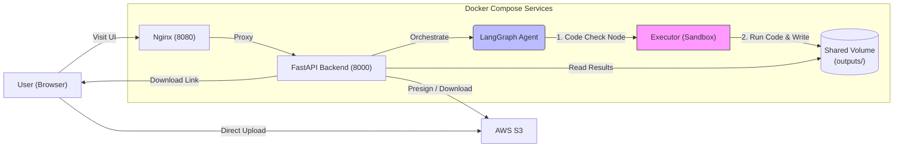
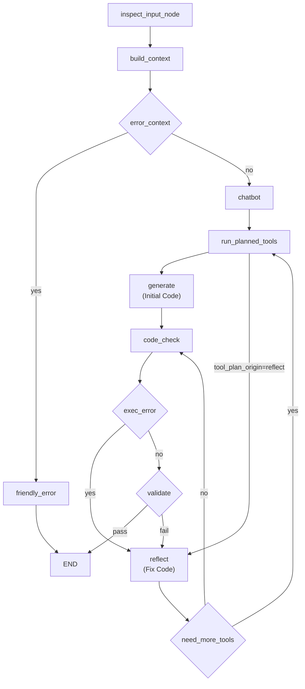
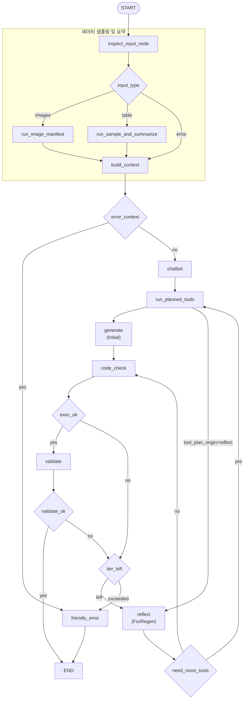

# 데이터 전처리 에이전트 (LangGraph + FastAPI) — 데모

자연어로 “이 데이터 전처리해줘”를 입력하면, **LangGraph 기반 에이전트가 입력 데이터를 검사·샘플링·요약**한 뒤 **요구사항을 구조화**하고, **필요한 전수 조사 도구(LLM 툴콜)를 선택/실행**한 다음 **전처리 파이썬 스크립트를 생성/실행**해 결과 파일을 생성하는 데모 프로젝트입니다.

이 프로젝트는 과거 파인튜닝 프로젝트를 진행할 때
**전처리 스크립트 작성 → 패키지 설치 → 오류 수정 → 재실행**을 반복하거나
원하지 않는 값이 섞여 나오는 문제를 줄이기 위해, 전처리 과정을 자동화하고자 만들었습니다.


핵심 개념을 간단히 정리하면 다음과 같습니다.

- **입력 검사**: 입력 경로/파일 유형을 먼저 판별해 흐름을 안정화합니다.
- **샘플링 + 요약**: 작은 샘플로 결측/분포/컬럼 타입을 요약해 LLM 판단 품질을 올립니다.
- **LLM 툴콜**: LLM이 필요한 범위만 효율적으로 스캔하기 위해 알맞는 툴들을 선택하여 스캔합니다.
- **코드 생성 + 실행**: 요구사항을 만족하는 스크립트를 생성하고 서버에서 실행합니다.
- **검증/리플렉트**: 실패 시 추가할 툴들이 있는지도 확인하고 자동 수정 루프를 돌려 성공 확률을 높입니다.


---

## ⚡ 주요 업데이트 (2024.12.26 ~ 2025.01.06)

해당 기간동안 대규모 리팩토링을 통해 시스템 안정성과 성능을 크게 개선하였습니다.

### 1. 보안 및 격리 강도
최근 보안 패치를 통해 데이터 처리의 안전성을 크게 강화했습니다.

*   **샌드박스 실행 환경**:
    *   **별도 컨테이너 실행**: LLM이 생성한 파이썬 코드는 Backend 서버가 아닌, **완전히 격리된 `Executor` Docker 컨테이너** 내부에서 실행됩니다.
    *   **영향 최소화**: 생성된 코드가 무한 루프에 빠지거나 시스템에 유해한 명령을 실행하더라도, Backend 서비스나 호스트 머신에는 직접적인 영향을 주지 않습니다.
*   **파일 시스템 격리**:
    *   **작업 디렉토리 제한**: Backend는 실행 시마다 고유한 `run_id` 기반의 하위 디렉토리를 지정하고, Executor는 해당 디렉토리 내에서만 파일 접근이 허용되어 **다른 실행 건이나 시스템 파일 접근을 원천 차단**합니다.
    *   **경로 탈출 방지**: 상위 디렉토리 점프 등의 경로 조작 시도를 방어하는 로직이 적용되어 있습니다.
*   **입력값 검증 및 스코프 관리**:
    *   **Strict Scope**: `exec()` 실행 시 전역/지역 변수 스코프를 엄격하게 관리하여, 불필요한 시스템 모듈 접근을 제한합니다.
    *   **Type Safety**: 실행 결과로 반환되는 데이터는 `Safe Serialization`을 거쳐 악성 객체 전달을 막습니다.

### 2. 성능 및 최적화

*   **병렬 툴 실행 및 데이터 스캔 최적화**: `asyncio.gather`를 도입하여 고유값 추출, 통계 산출, 인코딩 감지 등 독립적인 분석 작업을 **동시에 병렬로 수행**합니다. 이를 통해 대기 시간을 최소화하고, 필요한 부분만 정밀하게 스캔하여 불필요한 재시도(Refact)를 줄임으로써 **전체 처리 속도를 높이고 운영 비용을 절감**했습니다.

### 3. 에이전트 지능
*   **능동적 리플렉트**: 에러 발생 시 "정보가 부족하다"고 판단되면 스스로 **추가 툴**을 실행하여 단서를 모은 뒤 코드를 수정하는 고차원 추론 루프를 탑재했습니다.
*   **구조화된 출력 & 한국어 최적화**: Pydantic 기반의 Structured Output과 정교한 한국어 프롬프트로 지시 이행률과 안정성을 높였습니다.

### 4. 분석 도구 확장
*   **전수 조사 도구**: 단순 샘플링을 넘어 특정 부분 전수 스캔을 통해 정확한 메타데이터를 추출합니다.
    *   **효과**: 정확한 데이터 특성 파악으로 코드 생성 오류를 예방하여, **재시도(Refact) 횟수를 획기적으로 줄이고 전체 처리 시간과 분석 신뢰성을 동시에 확보**했습니다.
    *   `collect_unique_values`: 컬럼 고유값 추출 (범주형 데이터 분석)
    *   `mapping_coverage_report`: 매핑 키 커버리지 및 누락/초과 분석
    *   `collect_rare_values`: 이상치 또는 희귀값 식별
    *   `value_counts_topk`: 상위 빈도값 Top-K 및 비율 분석
    *   `summary_stats`: 수치형 통계(평균/중앙값/표준편차/분위수) 요약
    *   `detect_parseability`: 날짜/숫자 등 파싱 가능 여부 진단
    *   `detect_encoding`: 한글/특수문자 파일 인코딩 자동 감지
    *   `column_profile`: 컬럼별 타입/결측/샘플 종합 프로파일링
*   **포맷 대응 강화**: `Parquet`, `Feather`, `Arrow`, `Excel`, 대용량 `JSON` 등 다양한 데이터 포맷을 지원합니다.

### 5. 랭그래프 구조 효율화
*   **순환형 리플렉트 루프**: 기존의 단방향 흐름(에러→수정)을 개선하여, `reflect` 노드가 필요 시 `run_planned_tools`로 회귀하여 추가 정보를 수집한 후 다시 수정 단계로 돌아오는 **능동적 순환 구조**를 구현했습니다.
*   **조건부 엣지 최적화**: `route_after_reflect`, `route_after_tools` 등 라우팅 로직을 세분화하여 불필요한 노드 실행을 방지하고 상태 전이(State Transition)를 명확히 했습니다.
*   **상태 관리 모듈화**: 복잡한 그래프 로직을 `node_utils.py`와 `workflow.py`로 역할 단위로 분리하여 유지보수성과 확장성을 높였습니다.

### 6. 인프라 및 효율성
*   **홈서버 기반 마이크로서비스**: Ubuntu 기반 홈서버에 백엔드/프론트엔드/Executor를 Docker로 컨테이너화하여 구축, 자원 효율성을 극대화했습니다.
*   **운영**: 퍼블릭 클라우드 대신 유휴 장비를 활용하고, Cloudflare Tunnel을 통해 별도 IP 비용 없이 **안전한 HTTPS 외부 접속** 환경을 구현했습니다.

### 7. 최신 프레임워크 동기화
*   **LangChain & LangGraph**: 라이브러리 최신 버전을 적용 하였습니다.

---

## 🏗️ 아키텍처

### 전체 구성



S3를 사용하는 경우, **브라우저가 presigned URL로 업로드**하고 FastAPI는 **presign 발급 + 필요 시 S3에서 다운로드/경로 변환**을 수행합니다.
또한, **Backend는 생성된 코드를 직접 실행하지 않고 `Executor` 서비스로 전달**하여 격리된 환경에서 실행합니다.

### LangGraph 처리 흐름(핵심)

에이전트는 “입력 검사 → 데이터 샘플링/요약 → 요구사항 정리 + 툴 선택(LLM) → 선택된 툴로 전수 조사 → 코드 생성 → **Executor 실행** → 검증”을 수행하고,
실패하면 `reflect` 노드로 들어가 **최대 N회까지 자동 수정 루프**를 돕습니다.  
이때 `reflect`가 추가 툴이 필요하다고 판단하면 `run_planned_tools`로 가서 툴을 실행한 뒤 **다시 `reflect`로 복귀**해 수정 코드를 생성합니다.

아래는 **축약 버전(입력/샘플링 파트 요약)** 입니다.



<details>
<summary>상세 그래프 / 노드 설명 보기</summary>

각 단계의 책임을 분리해 **실패 지점 추적·재시도·확장**을 쉽게 하기 위한 구조입니다.  
예를 들어 `inspect_input_node`에서 입력을 먼저 고정 로직으로 판별하면 **툴 선택 오류를 줄이고**,  
이미지 폴더/테이블/경로 오류 같은 **입력 유형별 분기**도 명확히 유지됩니다.




### 노드별 역할 요약
- **chatbot**: LLM이 요청 분석, 요구사항 정리, 필요한 툴 선택
- **inspect_input_node**: 입력 경로 검사 및 포맷/타입 판별
- **run_sample_and_summarize**: 테이블 샘플링 및 최소 요약(컬럼/타입/결측) 생성
- **run_image_manifest**: 이미지 폴더를 CSV 매니페스트로 변환
- **build_context**: context 확정 및 오류 컨텍스트 설정
- **run_planned_tools**: 선택된 툴(전수 조사) 실행 후 결과를 context에 추가
    - **지원 툴 목록**:
        - `collect_unique_values`: 범주형/명목형 컬럼의 모든 고유값 추출 (오타 방지, 매핑용)
        - `mapping_coverage_report`: 매핑 작업 시 키 커버리지 분석 (누락/초과값 감지)
        - `collect_rare_values`: 빈도가 매우 낮은 이상치(Outlier) 또는 희귀값 식별
        - `value_counts_topk`: 값의 빈도수 상위 K개 및 비율 분석 (데이터 편향 파악)
        - `summary_stats`: 수치형 데이터의 기초 통계량(평균, 중앙값, 편차 등) 산출
        - `detect_parseability`: 날짜/숫자 형식 파싱 가능 여부 진단 (파싱 에러 방지)
        - `detect_encoding`: 파일의 인코딩(euc-kr, utf-8, cp949 등) 자동 감지
        - `column_profile`: 컬럼 타입, 결측률, 샘플 등을 종합 프로파일링
- **friendly_error**: 사용자에게 보여줄 오류 메시지 생성(중간/최종 오류 공통)
- **generate**: 전처리 파이썬 스크립트 생성
- **code_check**: 생성된 코드 실행 및 stdout/validation_report 수집
- **validate**: validation_report 검증(요구사항/가드레일)
- **reflect**: 오류 원인 기반 코드 재생성

</details>

---


## 어떻게 “전처리”가 수행되나 (동작 설명)

1) **입력**: 사용자는 “요청 문장”과 파일/폴더를 제공  
2) **입력 검사/ 분기**: `inspect_input_node`가 경로를 검사하고 입력 타입에 따라 분기  
3) **샘플링/요약**: 테이블이면 `sample_table` → 요약, 이미지 폴더면 이미지 매니페스트 생성 
4) **요구사항 정리 + 툴 선택**: LLM이 샘플링 컨텍스트를 보고 요구사항을 정리하고 필요한 전수 조사 툴을 선택  
5) **전수 조사**: `run_planned_tools`가 선택된 툴을 **병렬로 실행**하여 빠르게 정보를 수집하고 결과를 context에 추가    
6) **코드 생성**: LLM이 “imports + 실행 가능한 스크립트”를 생성 (`backend/src/data_preprocessing/prompts.py`)  
7) **실행**: 생성된 코드를 **격리된 컨테이너**로 전송해 실행하고 결과를 수집  
8) **검증**: 스크립트는 `__validation_report__`를 반드시 작성해야 하며, 누락/placeholder 남발 등을 탐지해 실패 처리 → `reflect` 루프로 복귀  
9) **산출물**: 결과 파일을 `backend/outputs/`로 저장하고, `run_id`/`output_files`로 다운로드 링크를 제공  
10) **내부 기록(Trace)**: 실행 중 생성된 코드/에러/검증/샘플링/전수조사 결과를 모아 `run_<run_id>_internal_trace_내부기록.md`를 함께 생성

---

## 📖 사용 설명서 (User Guide)

### Step 1. 파일 업로드 (Upload)
웹 UI의 "파일 업로드" 영역에 전처리할 데이터를 드래그 획은 클릭하여 업로드하세요.
- **지원 포맷**: `.csv`, `.xlsx`, `.json`, `.parquet`, `.arrow` 등 단일 파일 및 **폴더(Directory, 이미지 데이터셋 등)**

### Step 2. 요청하기 (Request)
"전처리 요청" 입력창에 원하는 작업을 **자연어**로 적어주세요. 마치 사람에게 시키듯이 구체적으로 적을수록 결과가 정확합니다.

> **작성 예시 (Best Practice):**
> - "이 데이터(`data.csv`)를 읽어서 결측치는 평균으로 채우고, 'price' 컬럼의 이상치(상위 1%)를 제거한 뒤 `parquet` 포맷으로 저장해줘."
> - "범주형 컬럼들은 원핫 인코딩해주고, 날짜 컬럼은 년/월/일로 분리해서 파생 변수를 만들어줘."

### Step 3. 모델 선택 (옵션)
필요하다면 **분석 모델**과 **코딩 모델**을 다르게 설정할 수 있습니다.
- **Analysis Model (분석용)**: `gpt-4o-mini` 권장 (빠르고 저렴하게 요약 및 툴 계획)
- **Coding Model (코딩용)**: `gpt-4.1` 권장 (복잡한 로직 구현 및 검증 코드 작성에 탁월)

### Step 4. 실시간 진행 모니터링
요청을 보내면 화면에 **실시간 진행 단계(Stepper)** 가 표시됩니다. AI가 어떻게 생각하고 일하는지 지켜보세요.
1.  **🔍 데이터 분석 (Inspect & Sample)**: 데이터를 뜯어보고 컬럼 구조와 타입을 파악합니다.
2.  **🧠 계획 수립 (Planning)**: "아, 이 컬럼은 고유값을 전수 조사해야겠네?" 하고 필요한 도구를 고릅니다.
3.  **🏃 도구 실행 (Tools)**: 선택한 도구들을 병렬로 실행해 필요한 메타데이터(고유값, 분포 등)를 수집합니다.
4.  **💻 코드 생성 & 실행 (Generate & Exec)**: 수집된 정보를 바탕으로 완벽한 파이썬 코드를 짜서 격리된 환경에서 돌립니다.
5.  **✅ 검증 (Validate)**: 결과물이 요구사항에 맞는지 스스로 채점합니다. 틀리면 다시 고칩니다.

### Step 5. 결과 확인 및 다운로드
모든 작업이 끝나면 완료 메시지와 함께 다운로드 버튼이 생깁니다.
- **결과 파일**: 요청한 포맷(csv, parquet 등)으로 정제된 데이터입니다.
- **미리보기**: `Preview` 버튼을 눌러 결과 데이터의 상위 20행을 즉시 확인해보세요.
- **내부 기록(Trace)**: `run_..._internal_trace.md` 파일에는 AI의 생각 과정, 실행한 코드, 에러 해결 로그가 모두 담겨 있습니다. (디버깅용)

> **⚠️ 주의**: 결과 파일은 생성 후 **30분 뒤에 자동 삭제**됩니다. 필요한 파일은 바로 다운로드하세요.

---

## 🚀 빠른 시작 (Docker, 권장)

1) 루트에서 `.env` 준비

```bash
cp .env.example .env
```

`.env`에 아래를 채우세요(따옴표 없이):

```env
OPENAI_API_KEY=...
AWS_REGION=eu-north-1
S3_BUCKET=handsukwoo
AWS_ACCESS_KEY_ID=...
AWS_SECRET_ACCESS_KEY=...
```

참고:
- S3 업로드를 쓰지 않으면 AWS 키는 생략 가능합니다.

2) 실행

```bash
docker compose up --build
```

3) 접속

- UI: `http://localhost:8080`
- API 헬스체크: `http://localhost:8000/health`

중지:

```bash
docker compose down
```

### 파일 업로드 방식 (S3 / 서버 업로드)

UI는 우선 **S3 presigned PUT** 업로드를 시도합니다.
브라우저에서 S3로 직접 업로드하려면 **버킷 CORS 설정**이 필요합니다(미설정 시 Safari/Chrome에서 `Load failed` 가능).

S3 업로드가 실패하면 UI가 자동으로 `POST /upload`(서버 업로드)로 폴백합니다.

### 산출물/업로드 정리(자동 삭제)

실행 산출물과 업로드 파일은 **기본 30분 TTL**로 자동 삭제됩니다.

- 출력물: `backend/outputs/`
- 업로드: `backend/outputs/uploads/`
- 환경 변수로 조정 가능
  - `RUN_OUTPUT_TTL_SECONDS` (기본 1800초)
  - `RUN_OUTPUT_CLEANUP_INTERVAL_SECONDS` (기본 300초)

### 미리보기(Preview)

다운로드 링크와 별도로, 결과 파일 상위 행 미리보기를 제공합니다.

- `GET /downloads/{run_id}/{filename}/preview?n=20`
  - CSV/Parquet/XLSX 등 표 형식 파일만 지원
  - 응답: `{ filename, columns, rows }`

### 모델 선택 (상세)

- UI에서 **분석 모델 / 코드 생성 모델**을 각각 선택합니다.
  - 기본값: `gpt-4o-mini` / `gpt-4.1`
- 서버는 허용된 모델만 받으며, 허용 목록 외 모델은 400으로 거부됩니다.

### 내부 기록 파일 (Trace)

매 실행마다 아래 파일이 결과물로 함께 생성됩니다:

- `run_<run_id>_internal_trace_내부기록.md`

포함 내용:
- 단계별 타임라인 (`inspect_input_node → run_sample_and_summarize/run_image_manifest → build_context → chatbot → run_planned_tools → generate → code_check → validate → reflect`)
- 입력 유형에 따라 `run_image_manifest` 경로로 분기될 수 있음
- 각 iteration에서 생성된 코드(imports + script)
- 실행 오류(traceback), stdout, validation report
- 샘플링 결과 요약 + 전수 조사(tool_reports)

“블랙박스가 아닌 내부 동작 증빙”에 활용할 수 있습니다.

---

## ⚙️ CLI 실행 방법

Docker나 UI 없이 터미널에서 직접 에이전트를 실행할 수 있습니다. (개발 및 디버깅 용도)

1) **준비**:
   ```bash
   cd backend
   pip install -r requirements.txt
   # 루트의 .env가 있다면 로드됩니다.
   ```

2) **실행**:
   ```bash
   # 사용 예시
   python -m src.data_preprocessing.cli --request "데이터를 로드해서 요약해줘"
   ```

3) **주요 옵션**:
   - `--request`: 요청 문장 (필수)
   - `--max-iterations`: 최대 수정 시도 횟수 (기본 3)
   - `--llm-model`: 분석 모델 (기본 `gpt-4o-mini`)
   - `--coder-model`: 코드 생성 모델 (기본 `gpt-4.1`)
