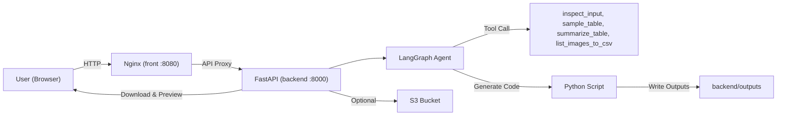
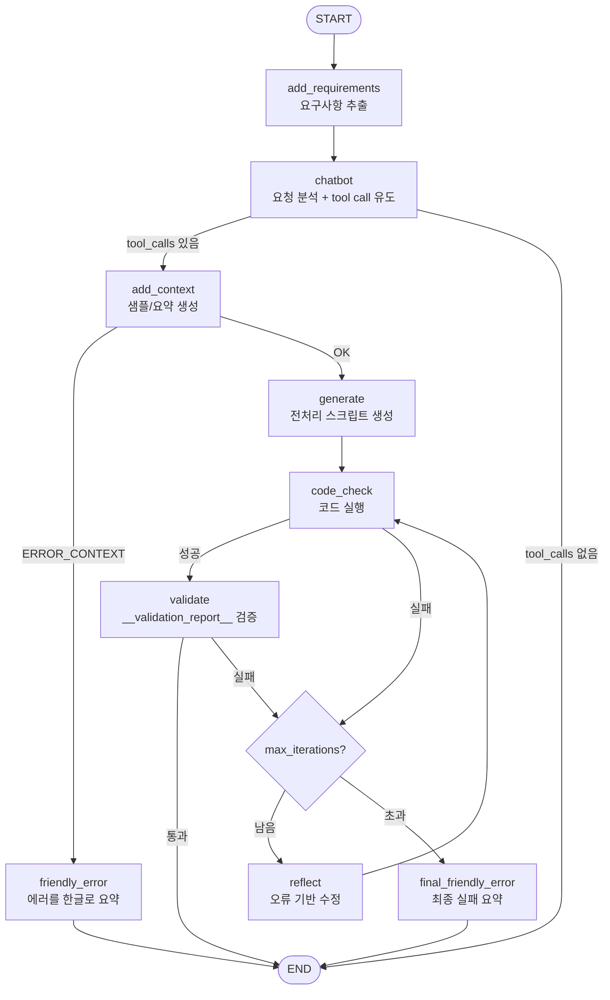

# 데이터 전처리 에이전트 (LangGraph + FastAPI) — 데모

자연어로 “이 데이터 전처리해줘”를 입력하면, **LangGraph 기반 에이전트가 데이터(파일/폴더/S3)를 샘플링·요약한 뒤 전처리 파이썬 스크립트를 생성/실행하고, 결과 파일을 생성**하는 데모 프로젝트입니다.

이 프로젝트는 과거 파인튜닝 프로젝트를 진행할 때,
**전처리 스크립트 작성 → 패키지 설치 → 오류 수정 → 재실행**을 반복하거나
원하지 않는 값이 섞여 나오는 문제를 줄이기 위해, 전처리 과정을 자동화하고자 만들었습니다.


---

## 빠른 시작 (Docker, 권장)

1) 루트에서 `.env` 준비

```bash
cp .env.example .env
```

`.env`에 아래를 채우세요(따옴표 없이):

```env
OPENAI_API_KEY=...
AWS_REGION=eu-north-1
S3_BUCKET=handsukwoo
AWS_ACCESS_KEY_ID=...
AWS_SECRET_ACCESS_KEY=...
```

참고:
- S3 업로드를 쓰지 않으면 AWS 키는 생략 가능합니다.

2) 실행

```bash
docker compose up --build
```

3) 접속

- UI: `http://localhost:8080`
- API 헬스체크: `http://localhost:8000/health`

중지:

```bash
docker compose down
```

---

## 사용 설명서

### 1) 요청 문장 작성

- 예: “업로드한 데이터를 정리하고 기준점 잡아서 요약 컬럼 추가 후 저장해줘”
- 요청 문장은 에이전트가 요구사항을 추출해 검증에 사용합니다.

### 2) 파일/폴더 업로드

- **로컬 파일/폴더 업로드**: UI에서 파일 또는 폴더 선택
- **S3 업로드**: UI가 presigned PUT로 S3 직접 업로드 시도
  - 실패 시 자동으로 서버 업로드로 폴백
- 업로드된 경로는 요청 문장 앞에 자동으로 붙습니다.

### 3) 모델 선택 (선택)

- **대화 모델**: 요구사항 정리/도구 호출/요약에 사용
- **코드 생성 모델**: 실제 전처리 스크립트 생성에 사용
- 서버는 허용된 모델만 받으며, 허용 목록 외 모델은 400으로 거부됩니다.

### 4) 실행 및 진행 상황 확인

- UI는 기본적으로 `POST /run_stream`으로 **실시간 진행 단계**를 표시합니다.
- 단계: 분석 → 샘플링 → 생성 → 실행 → 검증/리팩트 → 완료
- 오류가 발생하면 자동으로 리팩트 루프를 돌며 최대 N회 수정합니다.

### 5) 결과 확인 및 다운로드

- 결과 파일은 `run_id`와 함께 제공되며 다운로드 링크가 생성됩니다.
- 미리보기 지원: `GET /downloads/{run_id}/{filename}/preview?n=20`
- 내부 기록(Trace) 파일이 함께 생성되어 실행 과정과 오류를 추적할 수 있습니다.

### 6) 만료/정리 정책

- 결과물과 업로드는 **기본 30분 TTL** 이후 자동 삭제됩니다.
- 파일이 남아 있어도 `run_id`가 만료되면 다운로드가 실패할 수 있습니다.

---

## 아키텍처

### 전체 구성



### LangGraph 처리 흐름(핵심)

에이전트는 “요구사항 정리 → 데이터 샘플링 → 코드 생성 → 실행 → 검증”을 수행하고,
실패하면 `reflect` 노드로 들어가 **최대 N회까지 자동 수정 루프**를 돕습니다.



---

## 어떻게 “전처리”가 수행되나 (동작 설명)

1) **입력**: 사용자는 “요청 문장”과(선택) 파일/폴더를 제공  
2) **샘플링/요약**: `inspect_input` → `sample_table`/`summarize_table`로 데이터(또는 폴더) 샘플·요약 컨텍스트 생성  
3) **코드 생성**: LLM이 “imports + 실행 가능한 스크립트”를 생성 (`backend/src/data_preprocessing/prompts.py`)  
4) **실행**: 생성된 코드를 서버 프로세스에서 실행하고(stdout 캡처) 결과를 수집  
5) **검증(가드레일)**: 스크립트는 `__validation_report__`를 반드시 작성해야 하며, 누락/placeholder 남발 등을 탐지해 실패 처리 → `reflect` 루프로 복귀  
6) **산출물**: 결과 파일을 `backend/outputs/`로 저장하고, `run_id`/`output_files`로 다운로드 링크를 제공  
7) **내부 기록(Trace)**: 실행 중 생성된 코드/에러/검증/샘플링 요약을 모아 `run_<run_id>_internal_trace_내부기록.md`를 함께 생성

---

## 파일 업로드 방식 (S3 / 서버 업로드)

UI는 우선 **S3 presigned PUT** 업로드를 시도합니다.
브라우저에서 S3로 직접 업로드하려면 **버킷 CORS 설정**이 필요합니다(미설정 시 Safari/Chrome에서 `Load failed` 가능).

S3 업로드가 실패하면 UI가 자동으로 `POST /upload`(서버 업로드)로 폴백합니다.

---

## 산출물/업로드 정리(자동 삭제)

실행 산출물과 업로드 파일은 **기본 30분 TTL**로 자동 삭제됩니다.

- 출력물: `backend/outputs/`
- 업로드: `backend/outputs/uploads/`
- 환경 변수로 조정 가능
  - `RUN_OUTPUT_TTL_SECONDS` (기본 1800초)
  - `RUN_OUTPUT_CLEANUP_INTERVAL_SECONDS` (기본 300초)

---

## 미리보기(Preview)

다운로드 링크와 별도로, 결과 파일 상위 행 미리보기를 제공합니다.

- `GET /downloads/{run_id}/{filename}/preview?n=20`
  - CSV/Parquet/XLSX 등 표 형식 파일만 지원
  - 응답: `{ filename, columns, rows }`

---

## 모델 선택

- UI에서 **대화 모델 / 코드 생성 모델**을 각각 선택합니다.
  - 기본값: `gpt-4o-mini` / `gpt-4.1`
- 서버는 허용된 모델만 받으며, 허용 목록 외 모델은 400으로 거부됩니다.

---

## 내부 기록 파일 (Trace)

매 실행마다 아래 파일이 결과물로 함께 생성됩니다:

- `run_<run_id>_internal_trace_내부기록.md`

포함 내용:
- 단계별 타임라인 (`add_requirements → chatbot → add_context → generate → code_check → validate → reflect`)
- 각 iteration에서 생성된 코드(imports + script)
- 실행 오류(traceback), stdout, validation report
- 샘플링 결과 요약

“블랙박스가 아닌 내부 동작 증빙”에 활용할 수 있습니다.
